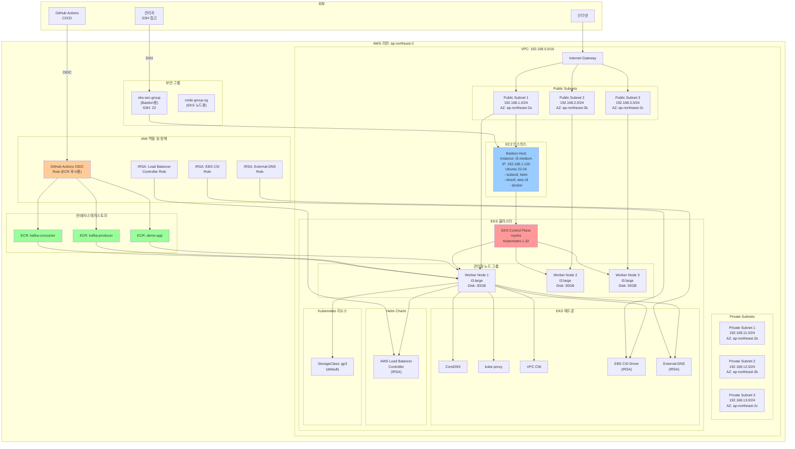
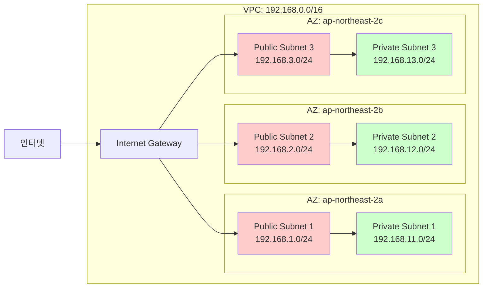
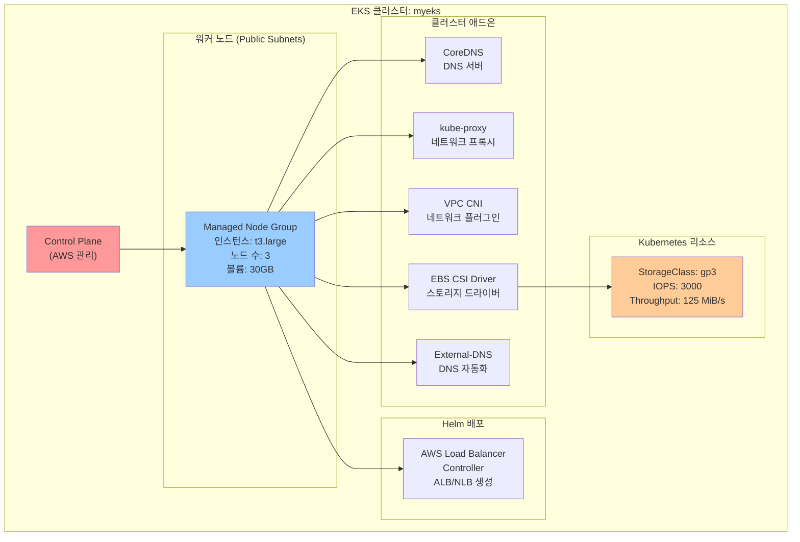
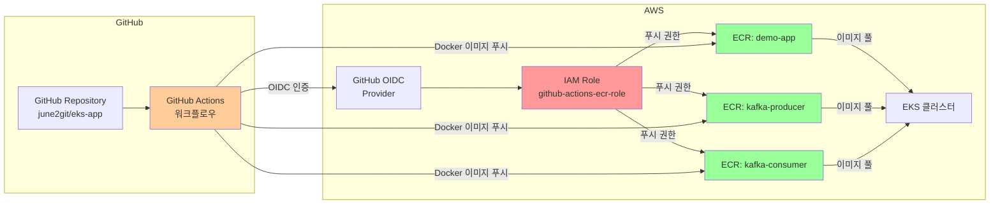
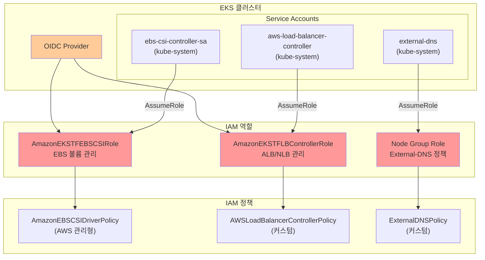

# 인프라 구조 도식화

## 전체 아키텍처

## 네트워크 구조 상세

## EKS 클러스터 구성 요소

## CI/CD 파이프라인

## IAM 역할 및 권한 (IRSA)

## 주요 리소스 요약

### 네트워크
- **VPC**: 192.168.0.0/16
- **Public Subnets**: 3개 (각 AZ마다 1개)
- **Private Subnets**: 3개 (각 AZ마다 1개)
- **Internet Gateway**: 1개
- **NAT Gateway**: 없음 (현재 구성)

### 컴퓨팅
- **EKS 클러스터**: myeks (Kubernetes 1.32)
- **워커 노드**: t3.large × 3개 (Public Subnets)
- **Bastion Host**: t3.medium × 1개 (Public Subnet 1)

### 컨테이너
- **ECR 저장소**: demo-app, kafka-producer, kafka-consumer

### 스토리지
- **StorageClass**: gp3 (기본)
- **EBS CSI Driver**: 활성화

### 보안
- **보안 그룹**: 2개 (Bastion용, Node Group용)
- **IRSA**: 3개 역할 (EBS CSI, Load Balancer Controller, External-DNS)
- **GitHub OIDC**: ECR 푸시용 역할

### CI/CD
- **GitHub Actions**: OIDC를 통한 ECR 푸시 자동화

